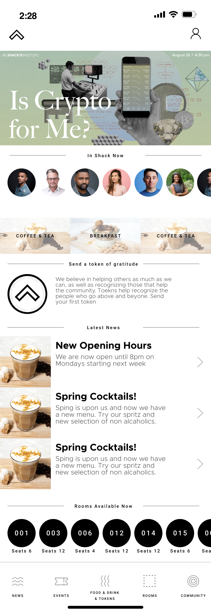
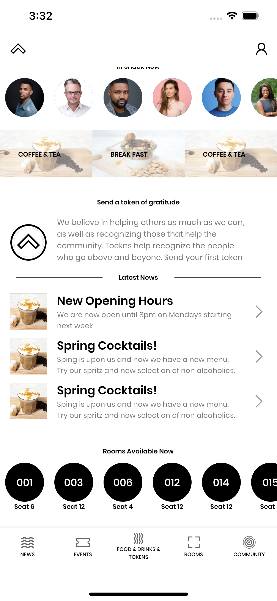
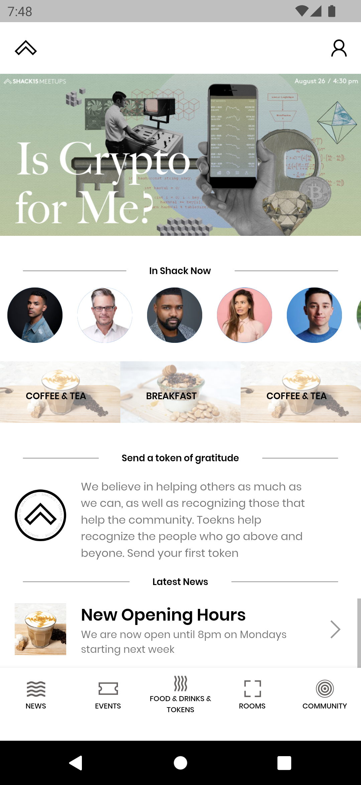
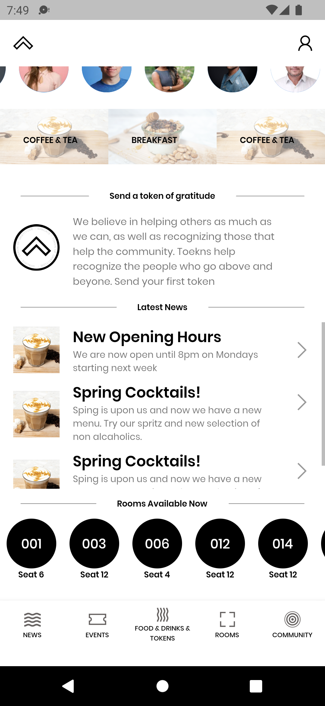

# SHACK15 Mobile Application


A new home page for the SHACK15 mobile app (UI Clone).

### UI Design




### Screenshots from iOS Device
|  |  |
|---|---|
|| |


### Screenshots from Android Device
|  |  |
|---|---|
|||

### Font Used
* [Poppins](https://fonts.google.com/specimen/Poppins)


<!-- This project is a starting point for a Flutter application. -->
### How to Clone Project

- First thing is to [download and install Git](https://git-scm.com/download/) if not already installed
- The next thing is to decide where to store the repository on your local machine. So open your terminal or cmd and navigate to your desired directory using the `cd` command, example :
```
cd development/flutterProjects
```
- After navigating to desired directory, copy and paste the follow command in your active terminal or cmd to clone this repository
```
git clone https://github.com/joeyyy688/shack15.git
```


### How to Run Project

-  Ensure flutter and the necessary tools have been properly installed and setup otherwise [install flutter along with the necessary tools needed by following this guide](https://docs.flutter.dev/get-started/install)
- Start a new terminal or cmd and run `flutter doctor`
- Ensure all the outputed list items start with a green checkbox before moving to the next step or else copy any issue the output brings to [stackoverflow](https://stackoverflow.com/) for answers from the community
- Locate the clonned project on your local machine and open with Android Studio or VScode
- Inside your desired IDE (Android Studio or VScode), go to the terminal and run the following command ```flutter pub get``` to get all the dependencies for the project
- Start the Android Emulator or iOS Simulator. To learn how to start [Android Emulator](https://docs.flutter.dev/get-started/install/windows) or [iOS Simulator](https://docs.flutter.dev/get-started/install/macos), follow the links attached
- Once either of the virtual mobile device selected is done loading, run the following command ```flutter run``` from the desired IDE's (Android Studio or VScode) terminal again
- After some few seconds the project should successfully build on the desired mobile device selected
- Incase you encountered some issues, post them to [stackoverflow](https://stackoverflow.com/) for answers from the community

### To Build Release Version

```
run: flutter build <OS PLATFORM> --release 
for example `flutter build ios --release` to build iOS release app 
or `flutter build apk` to build Android release apk
```

### Run test using IntelliJ or VSCode
#### IntelliJ 

* Open the widget_test.dart file
* Select the Run menu
* Click the Run 'tests in widget_test.dart' option
* Alternatively, use the appropriate keyboard shortcut for yourplatform.


#### VSCode
* Open the widget_test.dart file
* Select the Run menu
* Click the Start Debugging option
* Alternatively, use the appropriate keyboard shortcut for your platform.


### Run test in a terminal

You can also use a terminal to run the tests by executing the following command from the root of the project:
```
flutter test test/widget_test.dart
```


### Built With

- [Visual Studio Code](https://docs.flutter.dev/development/tools/vs-code) - How to use VScode for flutter app development
- [Flutter](https://flutter.dev) - Flutter Official website
